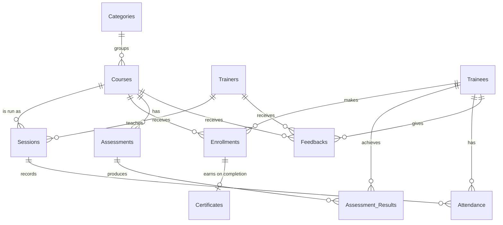

# Design Document

By OYELEYE, Matthew Oluwarotimi

- GitHub: Martphew07
- edX: OYELEYE Matthew Oluwarotimi
- From: Kwara State, Nigeria
- Recording date: July 12th, 2025

Video overview: <https://youtu.be/X8tMl6d1y4U>

This database was my final project for CS50's Introduction to Databases with SQL (HarvardX). The version in this repository has since been revised: the schema was tightened, the sample data was audited and cleaned, and the documentation was completed. The changes are described under [Data Quality](#data-quality).

## Scope

The database centralises the training operations of KickStart Digital Hub, a Nigerian company that trains people in Cybersecurity, Data Analysis, Programming and Basic ICT.

It is designed to:

- keep accurate records of trainees and trainers
- organise courses, sessions and enrollments
- record assessments, results, attendance, certificates and feedback
- track the payment status of each enrollment

With these processes in one place, the hub can run day-to-day operations with less manual work, see where trainees are struggling or dropping out, and use its own data when planning courses.

### In scope

People:

- **Trainees**, the individuals who enrol in training
- **Trainers**, the facilitators who deliver it
- **Admin staff**, who manage the records (they use the database but are not stored in it)

Training delivery:

- **Sessions** run at four physical hubs (Onehub, Genesishub, Faithhub and Hopehub), online, or as a hybrid of both

Records:

- **Categories** that group courses (Cybersecurity, Data Analysis, Programming, Basic ICT Skills)
- **Courses**, the structured programmes on offer
- **Enrollments**, recording which trainee signed up for which course, their progress, final score and payment status
- **Assessments**, the tests and projects attached to a course
- **Assessment results**, the score each trainee achieved
- **Attendance**, recorded per trainee per session
- **Certificates**, issued when an enrollment is completed
- **Feedback**, ratings and comments from trainees on courses and trainers

### Out of scope

Learning content itself (videos, notes, slides), user accounts and authentication, live class tracking, and detailed payment transactions such as amounts, dates and receipts.

## Functional Requirements

A user of the database should be able to:

**Manage trainees**
- add, update or delete trainee records
- view a trainee's enrollment history and performance

**Manage courses and sessions**
- create and edit courses, assigning a category and level
- schedule sessions with a trainer, dates, location and mode (online, offline or hybrid)

**Handle enrollments**
- enrol trainees in courses
- track progress (enrolled, ongoing, completed, dropped)
- see who has paid, partly paid, not paid or been refunded

**Record assessments, attendance and certificates**
- add tests and projects to a course and record trainee scores
- mark each trainee present, late or absent for a session
- issue certificates for completed enrollments and store a link to the certificate file

**Collect feedback**
- store trainee ratings (1 to 5) and comments on courses and trainers
- review average ratings per trainer

**Report**
- enrollment, completion and dropout counts per course
- average final score per course
- top-performing trainees
- attendance rates per session
- payment summaries and outstanding fees
- completed enrollments still waiting for a certificate

All of these are written out in `queries.sql`.

## Representation

SQLite has no ENUM type, so every column with a fixed set of values is stored as `TEXT` with a `CHECK` constraint listing the allowed values.

### Entities

#### Categories

- `category_id`: unique ID for the category, `INTEGER`, `PRIMARY KEY`.
- `name`: name of the category, `TEXT`, `NOT NULL` and `UNIQUE`.
- `description`: short description of the category, `TEXT`.

#### Trainees

- `trainee_id`: unique ID for the trainee, `INTEGER`, `PRIMARY KEY`.
- `first_name`, `last_name`: the trainee's names, `TEXT`, `NOT NULL`.
- `email`: email address, `TEXT`, `NOT NULL` and `UNIQUE`, so the same person cannot be registered twice.
- `date_of_birth`: `DATE`, `NOT NULL`.
- `gender`: `TEXT`, limited to `male` or `female`.
- `phone_number`: `VARCHAR(15)`. Stored as text rather than a number so leading zeros (e.g. `0803...`) are kept.
- `registration_date`: date the trainee registered, `DATE`, `NOT NULL`.

#### Trainers

- `trainer_id`: unique ID for the trainer, `INTEGER`, `PRIMARY KEY`.
- `first_name`, `last_name`: `TEXT`, `NOT NULL`.
- `phone_number`: `VARCHAR(15)`.
- `email`: `TEXT`, `NOT NULL` and `UNIQUE`.
- `specialization`: the trainer's main area, `TEXT`.
- `status`: `active` or `inactive`, `TEXT`, default `active`.

#### Courses

- `course_id`: unique ID for the course, `INTEGER`, `PRIMARY KEY`.
- `category_id`: the course's category, `INTEGER`, `FOREIGN KEY` referencing `category_id` in `Categories`.
- `title`: name of the course, `TEXT`, `NOT NULL`.
- `description`: `TEXT`.
- `duration`: length of the course as written text (e.g. "8 weeks"), `TEXT`.
- `level`: `beginner`, `intermediate` or `advanced`, `TEXT`.
- `status`: `active` or `inactive`, `TEXT`, default `active`.

#### Sessions

A session is one scheduled run of a course, taught by one trainer.

- `session_id`: unique ID for the session, `INTEGER`, `PRIMARY KEY`.
- `course_id`: `INTEGER`, `FOREIGN KEY` referencing `Courses`.
- `trainer_id`: `INTEGER`, `FOREIGN KEY` referencing `Trainers`.
- `start_date`, `end_date`: `DATE`. A `CHECK` stops the end date falling before the start date.
- `location`: the hub where the session runs, `TEXT`.
- `mode`: `online`, `offline` or `hybrid`, `TEXT`.
- `session_title`: `TEXT`.

#### Enrollments

- `enrollment_id`: unique ID for the enrollment, `INTEGER`, `PRIMARY KEY`.
- `trainee_id`: `INTEGER`, `FOREIGN KEY` referencing `Trainees`.
- `course_id`: `INTEGER`, `FOREIGN KEY` referencing `Courses`.
- `enroll_date`: `DATE`, `NOT NULL`.
- `progress_status`: `enrolled`, `ongoing`, `completed` or `dropped`, `TEXT`.
- `final_score`: `REAL` between 0 and 100, or `NULL` until the course is finished.
- `payment_status`: `paid`, `unpaid`, `partial` or `refunded`, `TEXT`.

The pair (`trainee_id`, `course_id`) is `UNIQUE`, so a trainee cannot be enrolled in the same course twice.

Whether a certificate has been issued is not stored in this table. It is worked out by checking whether a row exists in `Certificates`, so the two tables can never disagree.

#### Assessments

- `assessment_id`: unique ID, `INTEGER`, `PRIMARY KEY`.
- `course_id`: `INTEGER`, `FOREIGN KEY` referencing `Courses`.
- `title`: `TEXT`, `NOT NULL`.
- `description`: `TEXT`.
- `type`: `test` or `project`, `TEXT`.
- `total_score`: maximum possible score, `INTEGER`, greater than 0.
- `due_date`: `DATE`.

#### Assessment_Results

- `result_id`: unique ID, `INTEGER`, `PRIMARY KEY`.
- `assessment_id`: `INTEGER`, `FOREIGN KEY` referencing `Assessments`.
- `trainee_id`: `INTEGER`, `FOREIGN KEY` referencing `Trainees`.
- `score`: `REAL`, not negative.
- `submitted_on`: `DATE`.
- `remarks`: the assessor's comments, `TEXT`.

The pair (`assessment_id`, `trainee_id`) is `UNIQUE`: one result per trainee per assessment.

#### Attendance

- `attendance_id`: unique ID, `INTEGER`, `PRIMARY KEY`.
- `trainee_id`: `INTEGER`, `FOREIGN KEY` referencing `Trainees`.
- `session_id`: `INTEGER`, `FOREIGN KEY` referencing `Sessions`.
- `date`: date of the class, `DATE`, `NOT NULL`.
- `status`: `present`, `absent` or `late`, `TEXT`, `NOT NULL`.

#### Certificates

- `certificate_id`: unique ID, `INTEGER`, `PRIMARY KEY`.
- `enrollment_id`: `INTEGER`, `FOREIGN KEY` referencing `Enrollments`, `UNIQUE` so each enrollment has at most one certificate.
- `issue_date`: `DATE`, `NOT NULL`.
- `certificate_url`: link or file path to the certificate, `TEXT`.

The trainee and course are found through the enrollment. An earlier version also stored `trainee_id` and `course_id` here, and some certificates ended up naming a different trainee or course from their enrollment. Removing the copies removed that problem.

#### Feedbacks

- `feedback_id`: unique ID, `INTEGER`, `PRIMARY KEY`.
- `trainee_id`, `course_id`, `trainer_id`: `INTEGER`, each a `FOREIGN KEY` to its table.
- `rating`: `INTEGER` from 1 to 5, `NOT NULL`.
- `comments`: `TEXT`.
- `date_given`: `DATE`, `NOT NULL`.

### Relationships

- Each category contains many courses; each course belongs to exactly one category.
- A course can be run as many sessions, and each session is taught by one trainer. A trainer can teach many sessions.
- Trainees and courses have a many-to-many relationship, resolved by `Enrollments`: a trainee can take many courses and a course has many trainees, but each pair appears once.
- An enrollment earns zero or one certificate, and only once it is completed.
- A course has many assessments. Each trainee has at most one result per assessment.
- Attendance links trainees to sessions: one row per trainee per class.
- Feedback links a trainee to the course and trainer being rated.

## Optimizations

**Indexes.** Columns declared `UNIQUE` (trainee and trainer emails, the enrollment and result pairs, a certificate's enrollment) are indexed automatically by SQLite, so a separate index on trainee email is unnecessary. The extra indexes cover the foreign keys that reports join or filter on most:

| Index | Speeds up |
|---|---|
| `idx_enrollments_course` | enrollment counts and rosters per course |
| `idx_sessions_course` | finding the sessions for a course |
| `idx_attendance_session` | attendance summaries per session |
| `idx_attendance_trainee` | a trainee's attendance history |
| `idx_assessments_course` | listing a course's assessments |
| `idx_results_trainee` | a trainee's performance report |
| `idx_feedbacks_course`, `idx_feedbacks_trainer` | ratings per course and per trainer |

**Views.** Three views save staff from rewriting the same joins:

- `active_courses` lists each active course with every trainer who teaches it.
- `attendance_summary` counts present, late and absent trainees per session and gives an attendance rate.
- `course_summary` shows enrollments, completions, dropouts, average final score and certificates issued per course.

## Data Quality

The sample data was audited before publishing this version. The checks and every fix are recorded in `data_cleaning.sql`, and all of the checks now return no problems. In short:

- 3 duplicate trainee records, 7 duplicate enrollments, 1 duplicate session and 30 duplicate assessment results were removed. Most came from running the sample `INSERT` statements more than once.
- Two different trainees who shared an email address were given distinct emails, and an email typo was corrected.
- 42 registration dates of 31 June (a date that does not exist) were corrected to 30 June, and a submission date with month 13 was corrected using the assessment's due date.
- 38 certificates that broke the "certificates are issued on completion" rule, or named a trainee and course that did not match their enrollment, were removed.
- A missing score stored as the text `'NULL'` was converted to a real `NULL`.

The new `UNIQUE`, `NOT NULL` and `CHECK` constraints in `schema.sql` now stop these problems from being entered again.

Some records are flagged for review in `data_cleaning.sql` rather than changed, because the correct value is not known: attendance and results recorded for trainees who are not enrolled in that course, three session titles that name a different course from the one they are linked to, and two sessions whose end date is a year later than expected.

## Limitations

- Payments are recorded only as a status on each enrollment. Amounts, dates, methods and instalments would need a separate `Payments` table.
- The database stores information about courses but not the learning content itself; materials can only be referenced by URL.
- There is no support for real-time features such as live class tracking or online attendance capture.
- Trainee gender is limited to two values, and there is no field for a trainee's country or state, which would matter if the hub expanded beyond its current locations.
- Nothing prevents attendance being recorded for a trainee who is not enrolled in that session's course. SQLite `CHECK` constraints cannot look at other tables, so this would need a trigger.
- A trainee can enrol in a course only once, so retaking a course would need either a new design (e.g. an attempt number) or reusing the existing enrollment.
