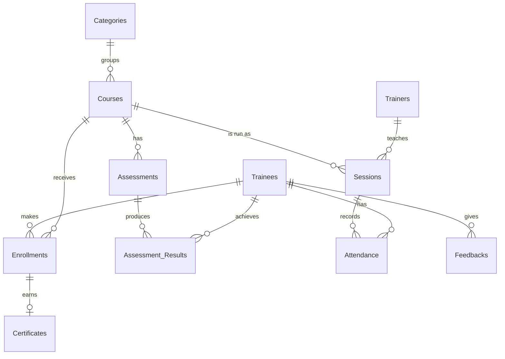

# KickStart Digital Hub: Training Management Database

A relational database, built in SQLite, for managing a digital skills training provider: trainees, trainers, courses, sessions, enrollments, assessments, attendance, certificates and feedback.

It started as my final project for [CS50's Introduction to Databases with SQL](https://cs50.harvard.edu/sql/) (HarvardX) and was later revised: I tightened the schema, audited the sample data, fixed the problems I found, and added reporting views and queries.

## What's in the database

11 tables and about 2,000 rows of sample data, including 369 trainees, 367 enrollments, 564 assessment results and 375 attendance records across 19 courses in four categories.



## Files

| File | Contents |
|---|---|
| `schema.sql` | Tables, constraints, indexes and views |
| `queries.sql` | Lookups, reports, and INSERT / UPDATE / DELETE examples |
| `data_cleaning.sql` | Data quality checks, and a record of every fix made to the sample data |
| `project.db` | The SQLite database with the cleaned sample data |
| `DESIGN.md` | Full design document: scope, entities, relationships, optimizations, data quality and limitations |

## What it shows

**Database design.** The schema is normalized. Trainees and courses are linked through an `Enrollments` table, and certificates hang off enrollments instead of repeating the trainee and course. `PRIMARY KEY`, `FOREIGN KEY`, `UNIQUE`, `NOT NULL` and `CHECK` constraints keep bad data out (for example, a trainee can't be enrolled in the same course twice, and a rating must be between 1 and 5).

**Data cleaning and validation.** Auditing the original sample data turned up duplicate trainees, enrollments, sessions and results; impossible dates such as 31 June; a score stored as the text `'NULL'`; and 38 certificates that were issued for incomplete enrollments or didn't match their enrollment. `data_cleaning.sql` contains the checks that found each problem and the fix applied. Records where the correct value couldn't be determined are flagged for review rather than guessed.

**Reporting.** Views and queries answer the questions a training manager would ask: enrollment, completion and dropout counts per course; average scores; top performers; attendance rates per session; outstanding fees; completed courses still waiting for a certificate; and average trainer ratings.

## Running it

You need [SQLite](https://www.sqlite.org/download.html) installed.

```bash
sqlite3 project.db
```

Then, inside SQLite:

```sql
.headers on
.mode column
SELECT * FROM course_summary;
.read queries.sql
```

`queries.sql` adds a sample trainee, walks her through enrollment, results, completion and certification, then removes her, so it can be run as often as you like without changing the data.

To rebuild an empty copy of the database from the schema:

```bash
sqlite3 new.db < schema.sql
```

## Author

Matthew Oyeleye, Data Analyst, Kwara State, Nigeria
[LinkedIn](https://linkedin.com/in/matthewoyeleye) · [GitHub](https://github.com/Martphew07)
